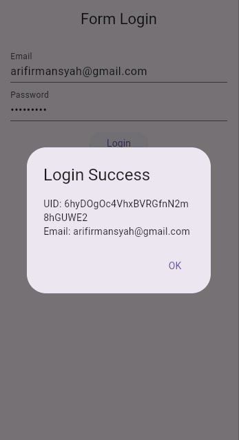

# 🎯 Week 10 Flutter — Membuat Form Login dengan Firebase

Tugas Week 10 mata kuliah **Mobile App**.
Aplikasi ini menampilkan **Form Login** menggunakan Flutter yang terhubung dengan **Firebase Authentication**.

---

## 📸 Hasil Screenshot





---

## 👤 Identitas

| Keterangan       | Data           |
| ---------------- | -------------- |
| **Nama Lengkap** | Ari Firmansyah |
| **NIM**          | 1123150127     |

---

## 🚀 Cara Menjalankan Project

> Pastikan sudah menginstal **Flutter SDK** minimal versi **3.x.x**

1. Jalankan perintah berikut:

   ```bash
   flutter pub get
   ```

2. Jalankan project di device atau emulator:

   ```bash
   flutter run
   ```

---

## 🧠 Catatan

Project ini masih merupakan **implementasi dasar form login menggunakan Firebase Authentication** dan dapat dikembangkan lebih lanjut dengan fitur register, logout, dan reset password.

---

✨ *Dibuat dengan sepenuh hati.*

